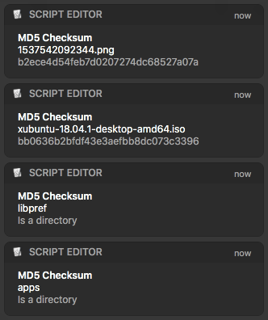

# pngoptimizefolder
macOS folder action service that watches ~/Downloads/ folder and automatically optimizes PNG pictures using zopflipng     


# Install
This service uses parallel and zopflipng utilities, make sure they are installed.

Homebrew:
```bash
brew install parallel
brew install zopfli
```

To add folder action service, open "PNG Optimize.workflow" and press Install.

Installation directory: ~/Library/Workflows/Applications/Folder Actions/

# Notice
Every *new* PNG file that gets dropped, downloaded or coppied into ~/Downloads/ folder gets optimized automatically, this service doesn't work recursively, e.g. new PNG files in ~/Downloads/foobar/ won't get optimized.
